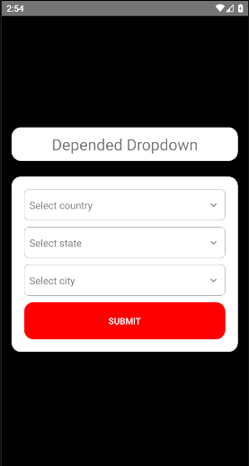

# Dependent Dropdown List in React Native

In this project I have created cascading dropdowns to display country, state and city list. Based on users selection of country list of state will apear and similarly based on country and state user will have list cities. 

## Project Setup
- Install the packages by using `npm install` command
- In the root path of the directory you'll find `.env_example` file, change that to `.env` and use your own API key from the site mentioned above.

## App Screenshot

